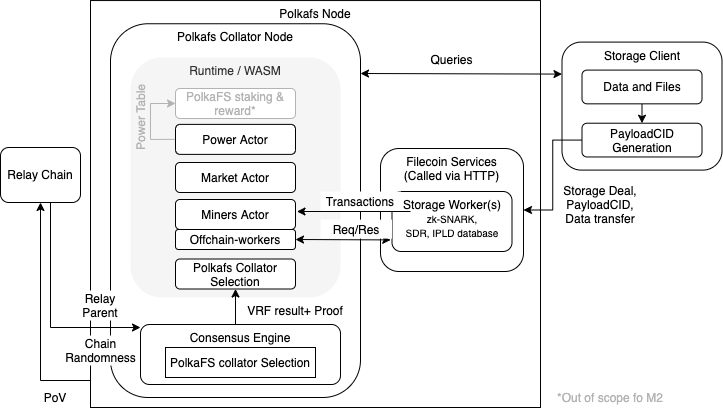

# Potential Solution Design

We propose potential solutions satisfying requirements described in [consensus] and [cryptographic] compatibility.

[consensus]: ./consensus.md#summary
[cryptographic]: ./crypto.md#summary

It is proposed that the PolkaFS node will consist of:

1. Cumulus Parachain development framework collator node
1. Miner node providing storage and cryptographic proofs on the state of storage

The Miner node is a separate service that communicates to the collator via off-chain workers and posts any updates to the chain state with signed transactions.

## On Consensus

The proposed design is one of many possible solutions. This is proposed based on usability for other Parachains and following the current implementation[^1].
In PolkaFS a storage miner is also the block producer and collator. The consensus mechanism differs from Filecoin's Expected Consensus due to incompatibilities outlined in [consensus].
PolkaFS will need to implement the following components on top of the current Cumulus Parachain node:

1. Verifiable random collator selection (reusable)
1. Collator reward calculation based on Storage Power and transactions inclusion

[^1]:
In the current implementation of Cumulus, the collator is assumed as the block producer i.e. producer of the Parachain block will also produce the Proof of Validity (PoV) block to submit to the relay validator.
Blocks are assumed to not be gossiped around between collators because _a collator has to produce a block with the relay parent of the latest relay chain block_.
This means that there is approx. 6 seconds to produce the PoV.

### Verifiably Random Collator Selection

In order to reward block producers on PolkaFS, it is essential to verify that the collator submitting the PoV block is entitled to produce a ParaBlock. This must be done in the State Transition Function submitted to the Relay Validators.
The existing BABE consensus on Polkadot and Substrate chains already provide most of the required functions to select slot winners with a Verifiable Random Function provided by the [Schnorkel] library and wrapped in [sp-consensus-vrf].  In addition to the winning VRF value, the slot winner must also submit the [WinningPoSt].

A new `Executor` (which implements [`ExecuteBlock`]) that verifies the VRF value and the WinningPoSt needs to be used when [registering] for [`validate_block`] to verify slot winner and that they have the sealed data up to the previous epoch.

When multiple block producers are selected as winners, the winners race to get their blocks accepted by the relay chain validators.
Only at most one block producer will get the rewards and for other block producers there will be no penalty or gain.

#### Randomness in VRF

For each block producer to run the VRF function and produce the WinningPoSt, randomness must be used as part of the input for security.
In Polkadot, [chain randomness] is used, which is the hash of VRF values from the blocks in the epoch before last (N-2).
Since the Parachain follows the relay chain, this may also be the source of randomness in the Parachain.

#### Multiple collator selection

The selection of multiple collators for the same slot is possible using the VRF function.
However, there can only be 1 ParaBlock finalised at a certain height, and it will depend on which collation gets more relay validator backing first.
Since the other collators were also selected, but were not the first one to submit collation, they should not be reported and their reputation on the relay chain should not be affected.

#### High level Block Executor logic

On a high level, the verification logic in the pallet's `Executor` will be similar to the [`BabeVerifier`] in the [`import queue`]:

1. Get header from ParaBlock
1. Get `Seal` signature from `DigestItem::Seal` in the header
1. Get `pre-digest` from `DigestItem::PreRuntime`, the set of `BABE` compatible pre-runtime `Digest`
1. Check the signer of the `Seal` is in a Authority list where they have staked
1. Verify the VRF output with the `pre-digest` items, relay parents header for randomness, other slot information in the epoch
1. Check the signer meets the threshold requirement

Currently in Cumulus, the provided consensus in the client is `relay_chain` (and `Aura` when merged).
This will be extended with Verifiable Random Collator Selection as used by PolkaFS collators, and supporting any future Parachains with this requirement.

### Collator Rewards

<!-- markdownlint-disable-next-line -->
*Note: This is specific to PolkaFS*

The reward for producing a valid block in PolkaFS should be proportional to the block producer's Storage Power in order to encourage storage providers to provide services to the clients.
It is also desirable to encourage as many paid extrinsics to be included as possible without overloading the block time, therefore the calculation using the `weights` system for transactions should also be used.

The block reward calculation will be done by the `PolkaFS staking` pallet, with input from values of collator Storage Power calculated and stored in `Power` pallet.

[Schnorkel]: https://crates.io/crates/schnorrkel
[sp-consensus-vrf]: https://crates.parity.io/sp_consensus_vrf/schnorrkel/struct.PublicKey.html
[registering]: https://github.com/paritytech/cumulus/blob/a90308b7cebdcb616d606c15dc528259bf134b55/pallets/parachain-system/src/validate_block/mod.rs#L71
[WinningPoSt]: https://spec.filecoin.io/#section-algorithms.pos.post.winningpost
[`validate_block`]: https://github.com/paritytech/cumulus/blob/a90308b7cebdcb616d606c15dc528259bf134b55/rococo-parachains/runtime/src/lib.rs#L419
[`ExecuteBlock`]: https://github.com/paritytech/substrate/blob/b0667821e61f4790da84930b7cdb80fb20b48596/frame/support/src/traits.rs#L2292
[`BabeVerifier`]: https://github.com/paritytech/substrate/blob/b0667821e61f4790da84930b7cdb80fb20b48596/client/consensus/babe/src/lib.rs#L953
[`import queue`]: https://github.com/paritytech/substrate/blob/b0667821e61f4790da84930b7cdb80fb20b48596/client/consensus/babe/src/lib.rs#L1608
[chain randomness]: https://wiki.polkadot.network/docs/en/learn-randomness#vrf
[`DigestItem::preRuntime`]: https://github.com/paritytech/substrate/blob/b0667821e61f4790da84930b7cdb80fb20b48596/client/consensus/babe/src/authorship.rs#L275

## On the State Transition Function and Cryptography

The STF for the Parachain should support both PoRep and PoSt, that rely on heavy use of the zk-SNARK and elliptic curve pairing.
The most expensive primitives are asymmetric cryptography e.g. SNARKs and aggregate signatures.
This means PolkaFS would benefit in a very high degree of natively supporting elliptic curve pairings and signatures.

A more tight integration between WebAssembly and the Polkadot core can be beneficial for STFs using common resource-intensive cryptography.
For instance, extending the Polkadot Keys to support BLS12 [as planned] and integrating elliptic curve pairing into Polkadot STF WebAssembly would allow much faster verification time for aggregate signatures.
Beside the underlying curve, PolkaFS would also benefit from standard constructions using the pairing, for instance BLS signatures (for matching choice of groups) and SNARKs.

Finally, PolkaFS would benefit from various other symmetric primitives such as the different hash functions (SHA256) and pseudo-random functions (ChaCha).
